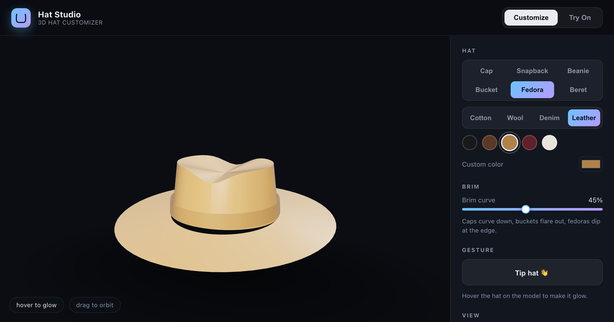

# Hat Studio — 3D 帽子定制器 + AR 试戴

**中文** | [English](#english)



> 在浏览器里定制属于你的帽子：6 种帽型、4 种面料、PBR 实时预览、帽檐弧度调节、脱帽致意动画，然后打开摄像头，把它"戴"在自己头上。
> Design hats in the browser with live PBR previews, then try them on your head with webcam AR face tracking.

[在线体验 Live Demo](https://hat.qiaomu.ai/) · [GitHub](https://github.com/joeseesun/hats-3d) · [MIT License](LICENSE)

**已验证:** Chromium + Playwright 无头测试通过（6 帽型渲染、帽檐滑块、脱帽动画、合成转头 ±35° 的 AR 遮挡）；本地 `python3 -m http.server` 一条命令即可运行。

## 这是什么

一个纯静态的 3D 帽子定制器 + 虚拟试戴（Virtual Try-On）demo。没有构建步骤、没有后端、没有外部模型文件——帽子几何体全部由代码程序化生成，Three.js 和 MediaPipe 均已 vendor 到仓库内，**克隆下来就能离线跑**。

姊妹项目：[Shade Studio 太阳镜定制器](https://github.com/joeseesun/sunglasses-3d)（[glass.qiaomu.ai](https://glass.qiaomu.ai/)）。

适合：想学习 Three.js PBR 材质 / MediaPipe 人脸追踪 / AR 遮挡处理（occluder）的开发者，以及想要一个能直接部署的试戴原型的产品同学。

## 核心能力

| 能力 | 你得到什么 |
|---|---|
| 拖拽环绕视角 | 阻尼轨道相机，任意角度检查帽子 |
| 6 种程序化帽型 | Cap / Snapback / Beanie / Bucket / Fedora / Beret，几何体实时重建 |
| PBR 面料实时切换 | 棉布 / 羊毛(sheen) / 牛仔 / 皮革(clearcoat)，程序化环境反射 |
| 帽檐弧度滑块 | 棒球帽下弯、渔夫帽外扩、费多拉边缘下垂，实时重建几何 |
| 脱帽致意动画 | 0.9s 点头致意（Tip hat 👋） |
| 悬停发光 | 悬停帽子出现柔和脉冲光 |
| Webcam AR 试戴 | MediaPipe FaceMesh 追踪位置/缩放/roll/yaw/pitch |
| 物理级遮挡 | 深度-only 人脸遮挡体 + 头骨椭球：转头时脑后的帽身被头挡住 |
| 绕头骨旋转 | 帽子挂在"头骨枢轴"上，转头时绕头旋转而不是绕自身漂移 |
| 滑动切换帽型 | 试戴模式下左右滑动（或鼠标横拖）循环切换，带名称提示 |

## 快速开始

ES module 和摄像头都需要真实源（不能 `file://` 直开），用任意静态服务器即可：

```bash
git clone https://github.com/joeseesun/hats-3d.git
cd hats-3d
python3 -m http.server 8123
# 打开 http://localhost:8123
```

> 一切依赖都在仓库内（`vendor/`），无需联网。试戴模式会请求摄像头权限。

## 工作原理

- **程序化几何**：帽身用缩放半球/圆柱拼接，棒球帽檐用 `THREE.Shape` 新月形贝塞尔轮廓挤出后按滑块值逐顶点下垂（droop），费多拉是环形帽檐 + 顶部压褶，贝雷帽是压扁半球斜放 + 包边 + 小柄。
- **姿态解算**：yaw/pitch 来自 3D 人脸法向量（MediaPipe landmark 的 z 即朝向摄像头的深度），roll 来自双眼连线，逐帧平滑。
- **双遮挡体**：① FaceMesh 468 点三角剖分构建只写深度的隐形人脸网格（挡住探到脸后的帽檐）；② 一个随头部姿态旋转的深度-only 头骨椭球（转头时挡住脑后的帽身）——帽子"长"在头上而不是浮在脸上。
- **头骨枢轴**：帽子不是直接钉在额头上旋转，而是挂在以颅腔中心为原点的枢轴组里，帽带锚点按未旋转的偏移量置于枢轴前方——转头时帽子绕头骨走圆弧，物理正确，侧头不漂移。
- **手势**：试戴模式监听 stage 上的 pointer 事件，水平位移超过阈值即切换帽型，`AbortController` 保证重复进出模式不叠加监听。

## 项目结构

```
index.html          # 标记、import map、MediaPipe 标签、SEO/OG
styles.css          # UI 样式
src/
  main.js           # 共享状态、UI 接线、模式切换、滑动切帽型
  hats.js           # 6 种程序化 PBR 帽型 + 材质/帽檐弧度/脱帽/发光逻辑
  customizer.js     # 渲染器、轨道相机、环境反射、悬停射线检测
  tryon.js          # 摄像头 + MediaPipe 追踪 + 头骨枢轴 + 双遮挡体
vendor/             # three.js r184 + MediaPipe face_mesh/camera_utils（离线可用）
```

## 限制与边界

- 试戴需要摄像头权限；仅处理单张人脸（`maxNumFaces: 1`）。
- 头骨椭球是固定比例的近似体，极端低头/仰头时帽身后缘可能露出轮廓边缘。
- 所有追踪均在浏览器本地完成，不上传任何画面或数据。
- 桌面 Chrome / Edge / Safari 测试通过；移动端浏览器可运行但未逐一适配。

## 贡献

欢迎 issue 和 PR——新增帽型只需要在 `src/hats.js` 里加一个 crown 构建分支（+ 可选的帽檐分支）。

## 关于作者

**向阳乔木** — [qiaomu.ai](https://qiaomu.ai) · [blog.qiaomu.ai](https://blog.qiaomu.ai) · [tuijian.qiaomu.ai](https://tuijian.qiaomu.ai) · X [@vista8](https://x.com/vista8) · GitHub [@joeseesun](https://github.com/joeseesun) · 微信公众号「向阳乔木推荐看」

---

<a name="english"></a>

# English

**Hat Studio** is a build-free, fully static 3D hat customizer with a webcam AR try-on mode. All geometry is procedural (no GLTF files), and both Three.js and MediaPipe are vendored in the repo, so it runs offline straight after cloning. Sister project of [sunglasses-3d](https://github.com/joeseesun/sunglasses-3d).

**Live demo:** https://hat.qiaomu.ai/

### Features

- Drag-orbit 3D preview with real PBR fabrics (cotton / wool / denim / leather)
- 6 procedural hat styles: Cap, Snapback, Beanie, Bucket, Fedora, Beret
- Live brim-curve slider that reshapes geometry (cap droop, bucket flare, fedora dip)
- "Tip hat" nod animation and hover glow
- Webcam AR try-on: position, scale, roll, yaw and pitch from MediaPipe FaceMesh
- Physical occlusion: a depth-only face mesh plus a skull ellipsoid that rotates with your head — turn sideways and the back of the crown is hidden by your head
- Hats ride on a skull-centred pivot, so head turns rotate the hat around the head instead of drifting sideways
- Swipe left/right in try-on mode to cycle hat styles

### Quick start

```bash
git clone https://github.com/joeseesun/hats-3d.git
cd hats-3d
python3 -m http.server 8123   # then open http://localhost:8123
```

ES modules and the webcam require a real origin, so serve the folder over HTTP (`localhost` is a secure context). No internet connection needed — everything is vendored.

### How it works

- Pose (yaw/pitch) is solved from the **3D face normal** using landmark depth, roll from the eye line; smoothed per frame.
- Two occluders: the MediaPipe face tesselation as an invisible depth-only mesh (hides brim tips behind the face), and a depth-only skull ellipsoid rotating with the pose (hides the back of the crown on head turns).
- The hat group is parented to a pivot at the skull centre; the band anchor is placed at an unrotated offset ahead of the pivot, so yaw/pitch swings the hat around the skull on a physically correct arc.
- Crowns are scaled hemispheres/cylinders; cap brims are crescent `THREE.Shape`s extruded and drooped per-vertex by the curve slider.

### Limits

- Single face tracking, webcam permission required; nothing leaves the browser.
- The skull ellipsoid is a fixed-ratio approximation, so crown edges can peek out at extreme pitch angles.

### License

MIT © 向阳乔木 (joeseesun)
